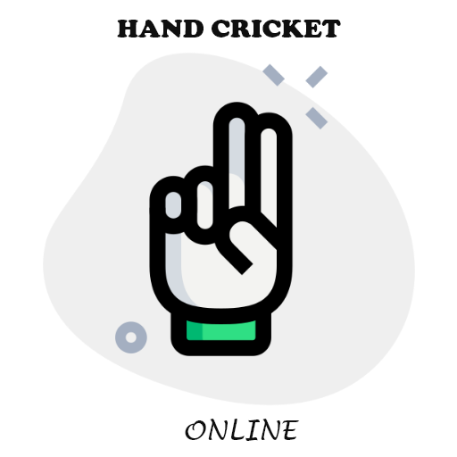
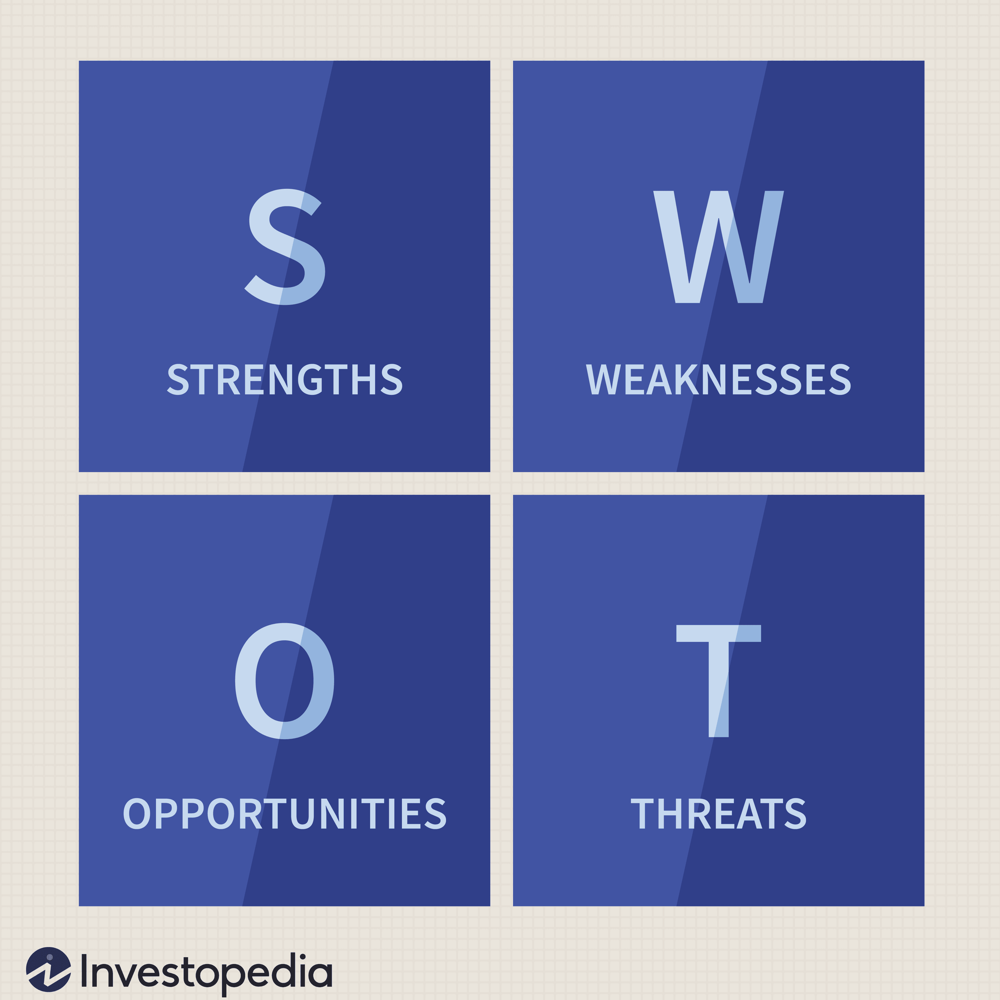

# Requirements
## INTRODUCTION
This system is a gaming application which allows user to select between various games and play accordingly.The games which are available as of now are Hangman and Hand cricket.

## COST AND FEATURES:
### cost:

The size of the game will be added once it is done
### Features:
The system offers the user to select between two games namely Hangman and handcricket
Hangman is multiplayer game and need minimum of two player to play this game
Handcricket is a single player game which allows the user to play with the computer
## DEFINING OUR SYSTEM
This system is a gaming application which allows the user to play with any one of the defined games.System consists off two games Hangman and handcricket.
### Hangman:
Hangman is a paper and pencil guessing game for two or more players. One player thinks of a word, phrase or sentence and the other(s) tries to guess it by suggesting letters within a certain number of guesses.

### Handcricket:
Hand cricket is played through gestures (called 'throws') similar to rock paper scissors. The total number of fingers extended equates to the equivalent number, with a thumb counting as 6. Throws are made simultaneously by both players, one designated as the batter and the other as the bowler. Runs scored according to the batter's throws until the bowler throws the same, in which case the batter is "out". It is played by school children in India,[18] Sri Lanka and Pakistan.

## SWOT ANALYSIS

### Strength
The strength of hangman game is that it's useful for English because it improves your spelling.If you keep on practicing and playing this game
The game becomes more fun when the number of players increases and it is also an educational game because you are learning and also having fun at the same time
The strength of handcricket game is that it help us to relive our childhood memories and also helps us to increase our focus.
### Weakness
The weakness for hangman game is that if the user is not able to guess the word then he might be bored.
The weakness of handcricket is that if the player gets bowled in the very first bowl itself then they will loose their intrest.
### Opportunity
Opportunity of hangman game is that you will learn how to spell better than you did before. It will mentally help you in english and for handcricket it will help to increase your focus.

### Threats
Threats would be that the users might not find any of these games useful and it is not making any improvement for them to improve their spelling and nor their focus.

### Who:
Users of almost all age can use this
### What:
This system is a gaming application which allows user to select between various games and play accordingly.The games which are available as of now are Hangman and Hand cricket.
### Where:
The user can use it to take a break from their highly scheduled life and also to enjoy .
### How:
The system asks the users to select any one of the game 
If the user selects Hangman:
1. system asks for the number of players
2. system also asks for the users name
3. system asks the number of rounds they are willing to play
4. system asks the non player member to give an word to guess
5. point 4 keeps on repeating for the other user as well and also until the number of rounds is completed

If the user selects Handcricket:
1. system asks for the number of over and also the number of player in your team
2. system asks if the user is willing to ball or bat
3. If you choose to bat
3. system asks us to select a number between 1 to 6 and if the selected number matches with the number that is randomly generated then you would be declared as out and if not the number you chose will be added to your score
5. If you choose to ball the procedure will be similar to that of point 4 and if the number that is chosen by you doesnt match with that of a computer then its run will increase

#DETAIL REQUIREMENT
##High level Requirement
#### HANGMAN
|Id No|Requirement|Category|
|--- |--- |--- |
|HR01|The system shall give an user to select between games|Technical|
|HR02|The system shall give an user to write their own name|Technical|
|HR03|The system shall display hangman structure everytime the users guess the character|Technical|
|HR04| The system shall display scores after each round|Technical|
|HR05|The system shall decide the winner|Technical|

### Hand cricket
|Id No|Requirement|Category|
|--- |--- |--- |
|HR06|System shall give an user to choose between bat and bowl|Technical|
|HR07|System shall give an user to select an user name|Technical|
|HR08|System shall decide the winner|Technical|
|HR09|The system shall display a text image when a user or computer gets out or hits a six or four|Technical|

## Low level Requirement

|ID No|Description|HR reference|Category|
|--- |--- |--- |--- |
|LL01|When the user runs the file it gives the user an option to select between the games which are available. As of now two games have been included namely hangman and handcicket and the user can choose anyone of them and play accordingly|HR01|Technical|
|LL02|This system also allows the user to type in their players name|HR02|Technical|
|LL03|After guessing of every  character the system should display hangman structure and it should also display the number of tries that is available for the user to guess the remaining character|HR03|Technical|
|LL04|After each round the system should display the users score so that they could know their position and could compete well with the other users|HR04|Technical|
|LL05|After completion of all rounds it is necessary for the system to decide the winner and also give a end conclusion|HR05|Technical|
|LL06|In the second game which is included the system gives the user an option to either bat first or ball first rather than using the typical method of tossing the coin here the user has an comfortability to select either to ball or bat first|HR06|Technical|
|LL07|Even in this game it gives the user an option to select his own game name|HR07|Technical|
|LL08|The system will decide the winner by comparing the runs scored by that of a computer and that of a user|HR08|Technical|
|LL09|The text image or the ASCII image will be stored in the text file and whenever the user or computer hits a six or a four or gets out the text image based on each scenario pops up and shows the display|HR09|Technical|

